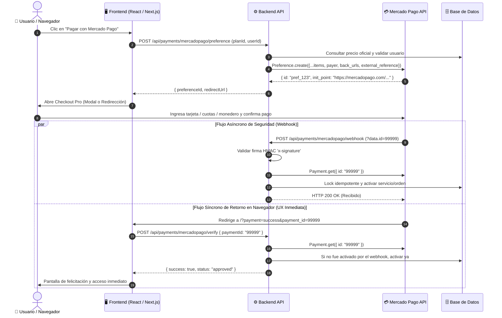

# 💳 GUIA MAESTRA: INTEGRACIÓN PROFESIONAL DE MERCADO PAGO EN APLICACIONES WEB
> **Guía de ingeniería y playbook de implementación directa para desarrolladores y agentes de IA.**
> Diseñada para ser entregada a cualquier IA o equipo técnico con el objetivo de construir una integración de Mercado Pago robusta, segura, homologada y lista para producción desde el primer intento.

---

## 📑 ÍNDICE
1. [Filosofía y Modelo Mental: ¿Qué Checkout Elegir?](#1-filosofía-y-modelo-mental-qué-checkout-elegir)
2. [Arquitectura y Ciclo de Vida del Pago (Flujo End-to-End)](#2-arquitectura-y-ciclo-de-vida-del-pago-flujo-end-to-end)
3. [Las 7 Trampas Mortales de Mercado Pago (Experiencia de Trinchera)](#3-las-7-trampas-mortales-de-mercado-pago-experiencia-de-trinchera)
4. [Gestión de Credenciales y Variables de Entorno](#4-gestión-de-credenciales-y-variables-de-entorno)
5. [Backend: Creación de la Preferencia (`Preference`)](#5-backend-creación-de-la-preferencia-preference)
6. [Backend: Webhook Seguro con Verificación Criptográfica (`x-signature`)](#6-backend-webhook-seguro-con-verificación-criptográfica-x-signature)
7. [Backend: Verificación Inmediata en el Retorno del Cliente (`Verify Route`)](#7-backend-verificación-inmediata-en-el-retorno-del-cliente-verify-route)
8. [Frontend: Integración del Botón y Experiencia de Usuario](#8-frontend-integración-del-botón-y-experiencia-de-usuario)
9. [Idempotencia y Base de Datos: Esquema de Persistencia](#9-idempotencia-y-base-de-datos-esquema-de-persistencia)
10. [Protocolo de Pruebas en Sandbox y Homologación Oficial](#10-protocolo-de-pruebas-en-sandbox-y-homologación-oficial)
11. [Prompt Directivo para Transferir a Otra IA](#11-prompt-directivo-para-transferir-a-otra-ia)

---

## 1. FILOSOFÍA Y MODELO MENTAL: ¿QUÉ CHECKOUT ELEGIR?

Mercado Pago ofrece dos grandes modalidades de integración:

| Criterio | **Checkout Pro (Recomendado 95% de los casos)** | **Checkout API / Bricks (Personalizado)** |
| :--- | :--- | :--- |
| **Experiencia de Usuario** | Ventana modal o redirección a la pasarela segura de Mercado Pago. | Formulario incrustado directamente en el DOM de tu página (marca blanca). |
| **Medios de Pago Soportados** | **Todos automáticamente**: Tarjetas de crédito/débito, cuotas locales, dinero en cuenta de Mercado Pago, transferencias bancarias (SPEI, PSE, Pix), pago en efectivo (OXXO, PagoFácil, agentes). | Solo los medios que configures manualmente en tu interfaz. |
| **Cumplimiento PCI-DSS** | **Cero responsabilidad PCI**; ningún dato sensible de tarjeta roza tu servidor ni tu frontend. | Requiere tokenización vía `MercadoPago.js` y auditoría de formulario SAQ A-EP. |
| **Autenticación 3DS 2.0 y Antifraude** | Gestionado 100% por Mercado Pago con biometría y OTP bancario. | Requiere integrar device fingerprinting y flujos de desafío 3DS manuales. |
| **Mantenimiento y Actualizaciones** | Si MP añade un nuevo medio de pago (ej. Yape / Pix / cuotas sin interés), aparece solo. | Debes actualizar tu frontend y librerías cada vez que cambien contratos. |

> [!TIP]
> **Regla de Oro:** Para SaaS, venta de cursos, membresías o comercio electrónico estándar en Latinoamérica, **usa siempre Checkout Pro**. Es más rápido de implementar, tiene mayor tasa de conversión en la región (los usuarios confían en el logo y su cuenta de Mercado Pago) y minimiza rechazos por fraude.

---

## 2. ARQUITECTURA Y CICLO DE VIDA DEL PAGO (FLUJO END-TO-END)



---

## 3. LAS 7 TRAMPAS MORTALES DE MERCADO PAGO (EXPERIENCIA DE TRINCHERA)

Si una IA o desarrollador no conoce estas 7 trampas, **su integración fallará en producción o en pruebas**:

### Trampa 1: El Error de Autofinanciamiento (`cc_rejected_call_for_authorize`)
* **Problema:** Si el desarrollador o administrador realiza una prueba intentando pagar con una tarjeta o cuenta asociada al mismo correo, mismo RUT/DNI o mismo titular de la cuenta recaudadora de Mercado Pago, la pasarela **rechaza el pago de inmediato**.
* **Solución:** NUNCA uses la tarjeta del dueño de la cuenta de MP para probar. En producción usa una tarjeta de un tercero con un monto mínimo real. En sandbox, usa usuarios de prueba (*Test Users*).

### Trampa 2: La Falsa Confianza en el Payload del Webhook
* **Problema:** Creer que el Webhook de Mercado Pago viene con `{ status: "approved", amount: 100 }`.
* **Realidad:** El Webhook de Mercado Pago solo envía un aviso escueto:
  ```json
  { "action": "payment.updated", "type": "payment", "data": { "id": "1234567890" } }
  ```
  **Un atacante puede enviar un POST falso a tu webhook inventando que un pago fue aprobado.**
* **Solución:** Tu backend **JAMÁS** debe confiar en el cuerpo del webhook. Tu backend debe tomar el `data.id`, validar la firma criptográfica `x-signature` y luego llamar con su propio `ACCESS_TOKEN` a `Payment.get({ id })` para obtener la verdad absoluta directamente desde los servidores de Mercado Pago.

### Trampa 3: La Carrera de Activación Duplicada (Webhook vs. Redirect)
* **Problema:** Mercado Pago redirige al cliente a `back_urls.success` casi al mismo tiempo que dispara el Webhook HTTP. Si ambos ejecutan la lógica de otorgar la membresía o crear el pedido a la vez, se generan compras duplicadas o errores de clave única en la base de datos.
* **Solución:** Patrón de **Idempotencia**. Registrar el `payment_id` en una tabla de pagos con restricción `UNIQUE`. El primero que llega (sea el webhook o el verify del cliente) adquiere el bloqueo y activa; el segundo detecta que ya está activo y simplemente responde `success: true, duplicated: true`.

### Trampa 4: La Penalización por Falta de Datos del Pagador (Motor Antifraude)
* **Problema:** Si creas la preferencia enviando únicamente el precio y el título, el motor antifraude de Mercado Pago (CyberSource + Machine Learning) clasifica la transacción con riesgo alto y **rechaza hasta el 40% de pagos legítimos** con el mensaje `cc_rejected_high_risk`.
* **Solución:** Enviar siempre en el objeto `payer`: `name`, `surname`, `email`, `identification` (si aplica) y `description` detallada en los `items`. Esto maximiza el score de confianza crediticia.

### Trampa 5: Diferencia de Moneda y Cuentas Nacionales
* **Problema:** Una cuenta de Mercado Pago creada en Perú opera en **PEN** (Soles); en México en **MXN**; en Colombia en **COP**; en Argentina en **ARS**. Mercado Pago **no permite** que una cuenta estándar peruana cobre directamente en USD o MXN.
* **Solución:** Si tus precios base están en USD, debes implementar una función de conversión dinámica de tasa de cambio a la moneda local de la cuenta receptora antes de enviar la preferencia a Mercado Pago.

### Trampa 6: El Timeout de los Webhooks y el Bucle Infinito
* **Problema:** Si tu endpoint de Webhook tarda más de 5 segundos en procesar o arroja un código HTTP 500 por un fallo en tu base de datos, Mercado Pago asumirá que el webhook falló y lo reintentará cada ciertos minutos durante hasta **48 horas**.
* **Solución:** Responder con `status 200` o `status 201` de inmediato una vez recibido y procesado el evento, y encapsular la lógica en bloques `try/catch` defensivos.

### Trampa 7: Monto Mínimo de Transacción
* **Problema:** Enviar montos inferiores a la tarifa plana fija de Mercado Pago (ej. menos de S/ 3.00 PEN o menos de $15 MXN).
* **Solución:** Validar que el `unit_price` sea siempre superior al mínimo establecido por la regulación del país.

---

## 4. GESTIÓN DE CREDENCIALES Y VARIABLES DE ENTORNO

En el archivo `.env.local` (o variables del servidor en Vercel/AWS):

```env
# ============================================================================
# MERCADO PAGO CREDENCIALES OFICIALES
# ============================================================================
# Clave Pública: Solo se usa en el Frontend si vas a renderizar el Wallet/SDK JS
NEXT_PUBLIC_MERCADOPAGO_PUBLIC_KEY=TEST-xxxxxxxx-xxxx-xxxx-xxxx-xxxxxxxxxxxx

# Clave Privada (Access Token): NUNCA exponer en el cliente. Solo Backend Server
MERCADOPAGO_ACCESS_TOKEN=APP_USR-xxxxxxxxxxxxxxxx-xxxxxx-xxxxxxxxxxxxxxxxxxxxxxxxxxxxxxxx-xxxxxxxxxx

# Clave Secreta de Firma Webhook (Signature Secret en tu panel de Desarrolladores de MP):
MERCADOPAGO_WEBHOOK_SECRET=xxxxxxxxxxxxxxxxxxxxxxxxxxxxxxxxxxxxxxxxxxxxxxxxxxxxxxxxxxxxxxxx

# Entorno: 'sandbox' o 'production'
MERCADOPAGO_ENVIRONMENT=production

# URL Pública de Producción (Requerida para Webhooks y Retornos, DEBE TENER HTTPS)
NEXT_PUBLIC_SITE_URL=https://tudominio.com
```

---

## 5. BACKEND: CREACIÓN DE LA PREFERENCIA (`PREFERENCE`)

Instalar la SDK oficial v2 en el proyecto:
```bash
npm install mercadopago
```

Archivo: `src/app/api/payments/mercadopago/preference/route.ts` (Next.js App Router / Node.js):

```typescript
import { NextResponse } from "next/server";
import { MercadoPagoConfig, Preference } from "mercadopago";

export async function POST(req: Request) {
  try {
    const { planId, userId, userEmail, userName, userSurname } = await req.json();

    const accessToken = process.env.MERCADOPAGO_ACCESS_TOKEN;
    if (!accessToken) {
      return NextResponse.json(
        { success: false, error: "Servidor no configurado con MERCADOPAGO_ACCESS_TOKEN" },
        { status: 500 }
      );
    }

    // 1. Resolver el producto y precio en la base de datos (NUNCA confiar en montos que envía el cliente)
    // Supongamos que tu producto vale S/ 49.00 PEN
    const itemPrice = 49.00;
    const itemCurrency = "PEN"; // PEN, MXN, ARS, COP, BRL según tu país
    const itemTitle = "Membresía Pro Acceso Total - 1 Mes";

    // 2. Base URL pública y segura (Mercado Pago exige HTTPS en producción para webhooks)
    const siteUrl = process.env.NEXT_PUBLIC_SITE_URL || "https://tudominio.com";

    // 3. Inicializar el SDK de Mercado Pago
    const client = new MercadoPagoConfig({
      accessToken,
      options: { timeout: 10000 },
    });

    const preference = new Preference(client);

    // 4. Crear la estructura external_reference para conciliación
    const externalReference = JSON.stringify({
      userId,
      planId,
      userEmail,
      createdAt: new Date().toISOString(),
    });

    // 5. Construir el payload con todos los campos del Checklist de Calidad Oficial
    const preferenceData: any = {
      items: [
        {
          id: planId,
          title: itemTitle,
          description: "Acceso ilimitado a todas las funciones premium y simuladores.",
          category_id: "services", // 'services', 'learnings', etc.
          quantity: 1,
          currency_id: itemCurrency,
          unit_price: itemPrice,
        },
      ],
      payer: {
        email: userEmail,
        name: userName || "Estudiante",
        surname: userSurname || "Salesforce",
      },
      back_urls: {
        success: `${siteUrl}/?payment=success&provider=mercadopago`,
        pending: `${siteUrl}/?payment=pending&provider=mercadopago`,
        failure: `${siteUrl}/?payment=failure&provider=mercadopago`,
      },
      auto_return: "approved", // Redirige automáticamente al usuario apenas se aprueba
      binary_mode: true,       // CRÍTICO: Solo 'approved' o 'rejected' (evita pagos colgados)
      notification_url: `${siteUrl}/api/payments/mercadopago/webhook`,
      statement_descriptor: "MIPLATAFORMA", // Máx 11 caracteres en el resumen bancario
      external_reference: externalReference,
      metadata: {
        user_id: userId,
        plan_id: planId,
        user_email: userEmail,
      },
      payment_methods: {
        installments: 12, // Permite hasta 12 cuotas según el país
      },
    };

    const response = await preference.create({ body: preferenceData });

    return NextResponse.json({
      success: true,
      preferenceId: response.id,
      initPoint: response.init_point,               // URL para redirigir en producción
      sandboxInitPoint: response.sandbox_init_point, // URL para sandbox
    });
  } catch (error: any) {
    console.error("Error creando preferencia en Mercado Pago:", error);
    return NextResponse.json(
      { success: false, error: error.message || "Error al generar enlace de pago" },
      { status: 500 }
    );
  }
}
```

---

## 6. BACKEND: WEBHOOK SEGURO CON VERIFICACIÓN CRIPTOGRÁFICA (`x-signature`)

Archivo: `src/app/api/payments/mercadopago/webhook/route.ts`:

```typescript
import { NextResponse } from "next/server";
import { MercadoPagoConfig, Payment } from "mercadopago";
import crypto from "crypto";

/**
 * Validador criptográfico HMAC-SHA256 del header x-signature de Mercado Pago
 */
function verifyMercadoPagoSignature(
  xSignatureHeader: string | null,
  xRequestIdHeader: string | null,
  dataId: string,
  secretKey: string
): boolean {
  if (!xSignatureHeader || !secretKey) return true; // Si no hay secret configurado en dev, permitir

  try {
    // xSignatureHeader viene en formato: "ts=1700000000,v1=abcdef0123456789..."
    const parts = xSignatureHeader.split(",").reduce((acc: any, part) => {
      const [key, value] = part.split("=");
      if (key && value) acc[key.trim()] = value.trim();
      return acc;
    }, {});

    const ts = parts["ts"];
    const hash = parts["v1"];

    if (!ts || !hash) return false;

    // Crear el manifiesto oficial de Mercado Pago: "id:[data.id];request-id:[x-request-id];ts:[ts];"
    let manifest = `id:${dataId};`;
    if (xRequestIdHeader) {
      manifest += `request-id:${xRequestIdHeader};`;
    }
    manifest += `ts:${ts};`;

    // Generar el HMAC SHA-256
    const hmac = crypto.createHmac("sha256", secretKey).update(manifest).digest("hex");
    return hmac === hash;
  } catch (e) {
    console.error("Error verificando firma x-signature:", e);
    return false;
  }
}

export async function POST(req: Request) {
  try {
    const { searchParams } = new URL(req.url);
    const body = await req.json().catch(() => ({}));

    // Mercado Pago puede enviar el ID en el query string o en el cuerpo JSON
    const paymentId = searchParams.get("data.id") || body?.data?.id || searchParams.get("id") || body?.id;
    const topic = searchParams.get("type") || body?.type || body?.topic;

    // Solo nos interesan los eventos de tipo payment
    if (!paymentId || (topic && topic !== "payment")) {
      return NextResponse.json({ received: true });
    }

    // 1. Validar firma criptográfica (Opcional pero altamente recomendado en Producción)
    const xSignature = req.headers.get("x-signature");
    const xRequestId = req.headers.get("x-request-id");
    const webhookSecret = process.env.MERCADOPAGO_WEBHOOK_SECRET || "";

    if (webhookSecret && !verifyMercadoPagoSignature(xSignature, xRequestId, String(paymentId), webhookSecret)) {
      console.warn("Mercado Pago Webhook: Firma criptográfica inválida descartada.");
      return NextResponse.json({ error: "Firma inválida" }, { status: 401 });
    }

    const accessToken = process.env.MERCADOPAGO_ACCESS_TOKEN;
    if (!accessToken) {
      return NextResponse.json({ error: "No access token" }, { status: 500 });
    }

    // 2. Consultar directamente a Mercado Pago para saber el estado VERDADERO del pago
    const client = new MercadoPagoConfig({ accessToken, options: { timeout: 10000 } });
    const paymentService = new Payment(client);
    const payment = await paymentService.get({ id: String(paymentId) });

    if (!payment) {
      return NextResponse.json({ received: true });
    }

    console.log(`Webhook MP: Pago ${payment.id} estado = ${payment.status}`);

    // 3. Procesar únicamente si está formalmente APROBADO
    if (payment.status === "approved") {
      let extRef: any = {};
      try {
        extRef = JSON.parse(payment.external_reference || "{}");
      } catch {
        extRef = { userId: payment.external_reference };
      }

      const userId = extRef.userId || payment.metadata?.user_id;
      const planId = extRef.planId || payment.metadata?.plan_id;
      const email = payment.payer?.email || extRef.userEmail;

      // 4. Bloqueo de Idempotencia: Verificar si ya fue procesado en la BD
      // const alreadyProcessed = await dbCheckPaymentExists(String(payment.id));
      // if (!alreadyProcessed) {
      //    await dbActivateSubscription(userId, planId, String(payment.id));
      // }
    }

    // 5. Responder SIEMPRE con 200 OK inmediatamente
    return NextResponse.json({ success: true, status: payment.status });
  } catch (error: any) {
    console.error("Error en Webhook Mercado Pago:", error);
    // Devolvemos 200 con log para evitar que Mercado Pago reintente en bucle infinito si es un error de formato
    return NextResponse.json({ error: error.message }, { status: 200 });
  }
}
```

---

## 7. BACKEND: VERIFICACIÓN INMEDIATA EN EL RETORNO DEL CLIENTE (`VERIFY ROUTE`)

Cuando el usuario completa el pago, Mercado Pago lo redirige a:
`https://tudominio.com/?payment=success&payment_id=123456789&provider=mercadopago`

El webhook puede tardar entre 2 y 10 segundos en llegar por latencia de red. Para que el usuario no sienta que "pagó pero no se activó", se implementa este endpoint:

Archivo: `src/app/api/payments/mercadopago/verify/route.ts`:

```typescript
import { NextResponse } from "next/server";
import { MercadoPagoConfig, Payment } from "mercadopago";

export async function POST(req: Request) {
  try {
    const { paymentId } = await req.json();
    if (!paymentId) {
      return NextResponse.json({ success: false, error: "ID de pago requerido" }, { status: 400 });
    }

    const accessToken = process.env.MERCADOPAGO_ACCESS_TOKEN;
    const client = new MercadoPagoConfig({ accessToken: accessToken!, options: { timeout: 10000 } });
    const paymentService = new Payment(client);
    
    // Consultar estado real a Mercado Pago
    const payment = await paymentService.get({ id: String(paymentId) });

    if (!payment) {
      return NextResponse.json({ success: false, error: "Pago no encontrado" }, { status: 404 });
    }

    if (payment.status === "approved") {
      let extRef: any = {};
      try { extRef = JSON.parse(payment.external_reference || "{}"); } catch { extRef = {}; }
      
      const userId = extRef.userId || payment.metadata?.user_id;
      const planId = extRef.planId || payment.metadata?.plan_id;

      // Activar con verificación de idempotencia en BD
      // await dbActivateSubscription(userId, planId, String(payment.id));

      return NextResponse.json({
        success: true,
        status: "approved",
        message: "¡Pago verificado y suscripción activada con éxito!",
      });
    }

    return NextResponse.json({
      success: false,
      status: payment.status,
      message: `El pago se encuentra en estado: ${payment.status} (${payment.status_detail})`,
    });
  } catch (error: any) {
    return NextResponse.json({ success: false, error: error.message }, { status: 500 });
  }
}
```

---

## 8. FRONTEND: INTEGRACIÓN DEL BOTÓN Y EXPERIENCIA DE USUARIO

Componente React / Next.js: `src/components/MercadoPagoButton.tsx`:

```tsx
"use client";

import React, { useState } from "react";

interface Props {
  planId: string;
  userId: string;
  userEmail: string;
}

export function MercadoPagoButton({ planId, userId, userEmail }: Props) {
  const [loading, setLoading] = useState(false);
  const [errorMessage, setErrorMessage] = useState<string | null>(null);

  const handleCheckout = async () => {
    try {
      setLoading(true);
      setErrorMessage(null);

      // 1. Solicitar la creación de la preferencia a nuestro propio backend
      const response = await fetch("/api/payments/mercadopago/preference", {
        method: "POST",
        headers: { "Content-Type": "application/json" },
        body: JSON.stringify({ planId, userId, userEmail }),
      });

      const data = await response.json();

      if (!response.ok || !data.success) {
        throw new Error(data.error || "No se pudo iniciar el pago con Mercado Pago");
      }

      // 2. Redirigir al usuario al Checkout Pro oficial
      // En producción: data.initPoint; En pruebas locales: data.sandboxInitPoint o initPoint
      const redirectUrl = data.initPoint || data.sandboxInitPoint;
      if (redirectUrl) {
        window.location.href = redirectUrl;
      } else {
        throw new Error("No se recibió la URL de redirección");
      }
    } catch (err: any) {
      setErrorMessage(err.message || "Error al conectar con la pasarela.");
      setLoading(false);
    }
  };

  return (
    <div className="flex flex-col gap-2">
      <button
        onClick={handleCheckout}
        disabled={loading}
        className="w-full flex items-center justify-center gap-3 bg-[#009EE3] hover:bg-[#0082BD] text-white font-bold py-3.5 px-6 rounded-xl transition-all shadow-md active:scale-[0.98] disabled:opacity-50"
      >
        {loading ? (
          <span className="flex items-center gap-2">
            <svg className="animate-spin h-5 w-5 text-white" viewBox="0 0 24 24">
              <circle className="opacity-25" cx="12" cy="12" r="10" stroke="currentColor" strokeWidth="4" fill="none" />
              <path className="opacity-75" fill="currentColor" d="M4 12a8 8 0 018-8v8H4z" />
            </svg>
            Conectando a Mercado Pago...
          </span>
        ) : (
          <>
            <svg className="w-6 h-6 fill-current" viewBox="0 0 24 24">
              <path d="M21 4H3c-1.1 0-2 .9-2 2v12c0 1.1.9 2 2 2h18c1.1 0 2-.9 2-2V6c0-1.1-.9-2-2-2zm0 14H3V8h18v10z"/>
            </svg>
            <span>Pagar con Mercado Pago (Tarjetas / Cuotas)</span>
          </>
        )}
      </button>

      {errorMessage && (
        <p className="text-xs text-red-500 font-medium text-center">{errorMessage}</p>
      )}
    </div>
  );
}
```

---

## 9. IDEMPOTENCIA Y BASE DE DATOS: ESQUEMA DE PERSISTENCIA

Para evitar transacciones duplicadas o usuarios no activados ante ráfagas concurrentes:

```sql
-- Tabla de transacciones y conciliación de Mercado Pago en PostgreSQL / Supabase
CREATE TABLE IF NOT EXISTS public.payment_transactions (
    id TEXT PRIMARY KEY,                       -- Mercado Pago Payment ID (ej: '1234567890')
    user_id TEXT NOT NULL,                     -- ID del usuario en tu sistema
    provider TEXT NOT NULL DEFAULT 'mercadopago',
    plan_id TEXT NOT NULL,                     -- Plan adquirido
    amount NUMERIC(10, 2) NOT NULL,            -- Monto cobrado
    currency TEXT NOT NULL DEFAULT 'PEN',      -- Moneda local
    status TEXT NOT NULL,                      -- 'approved', 'rejected', 'refunded'
    status_detail TEXT,                        -- Detalle oficial de MP (ej: 'accredited')
    external_reference TEXT,                   -- Metadata enviada en la preferencia
    created_at TIMESTAMP WITH TIME ZONE DEFAULT NOW(),
    activated_at TIMESTAMP WITH TIME ZONE DEFAULT NOW(),
    CONSTRAINT uq_payment_provider_id UNIQUE (provider, id)
);

CREATE INDEX IF NOT EXISTS idx_payment_transactions_user ON public.payment_transactions(user_id);
```

### Función de Idempotencia en TypeScript:
```typescript
export async function activateSubscriptionIdempotent(payment: {
  transactionId: string;
  userId: string;
  planId: string;
  amount: number;
  currency: string;
}): Promise<{ alreadyProcessed: boolean }> {
  // 1. Intentar insertar la transacción. Si ya existe, la base de datos lo rechaza de inmediato (ON CONFLICT DO NOTHING)
  const insertResult = await db.query(
    `INSERT INTO public.payment_transactions (id, user_id, provider, plan_id, amount, currency, status)
     VALUES ($1, $2, 'mercadopago', $3, $4, $5, 'approved')
     ON CONFLICT (provider, id) DO NOTHING
     RETURNING id;`,
    [payment.transactionId, payment.userId, payment.planId, payment.amount, payment.currency]
  );

  // Si no devolvió filas, significa que ya fue procesado antes (idempotencia cumplida)
  if (insertResult.rowCount === 0) {
    return { alreadyProcessed: true };
  }

  // 2. Si es la primera vez que se procesa, extender la fecha de suscripción del usuario
  await db.query(
    `UPDATE public.users 
     SET subscription_plan = $2, 
         subscription_expires_at = NOW() + INTERVAL '30 days',
         is_active = TRUE
     WHERE id = $1;`,
    [payment.userId, payment.planId]
  );

  return { alreadyProcessed: false };
}
```

---

## 10. PROTOCOLO DE PRUEBAS EN SANDBOX Y HOMOLOGACIÓN OFICIAL

### 10.1 Tarjetas de Prueba Oficiales de Mercado Pago (Globales)
Para probar en modo Sandbox o con usuarios de prueba sin gastar dinero real:

| Estado Esperado | Número de Tarjeta | Fecha Exp. | CVC | Titular |
| :--- | :--- | :--- | :--- | :--- |
| **Aprobado Inmediato** | `4242 4242 4242 4242` | `11/28` | `123` | APRO |
| **Fondos Insuficientes** | `4023 3611 1111 1114` | `11/28` | `123` | FOND |
| **Rechazado por Tarjeta Vencida** | `4023 3611 1111 1115` | `11/20` | `123` | VENC |
| **Rechazado por Código de Seguridad**| `4023 3611 1111 1116` | `11/28` | `999` | SEGU |

> [!NOTE]
> Cuando estés en modo Sandbox, en el formulario de Checkout ingresa cualquier DNI/RUT/documento de prueba válido para el país configurado.

### 10.2 Checklist de Calidad para Pase a Producción (Homologación de Mercado Pago)
Mercado Pago cuenta con un motor automático de evaluación de calidad (*Quality Evaluation Tool*). Para que tu aplicación pase con calificación 100%:
- [x] Enviar `items[].quantity`, `items[].unit_price` y `items[].description`.
- [x] Enviar `statement_descriptor` (nombre de fantasía de tu tienda en el extracto bancario).
- [x] Configurar las 3 URLs de retorno (`back_urls.success`, `back_urls.pending`, `back_urls.failure`).
- [x] Configurar `auto_return: "approved"`.
- [x] Enviar `notification_url` con HTTPS para recepción de webhooks.
- [x] Enviar `external_reference` con identificador único de orden/usuario.
- [x] Enviar `payer.email` y `payer.name`.
- [x] Implementar verificación de estado mediante API `Payment.get({ id })` tras recibir el webhook.
- [x] Probar al menos un pago exitoso y un pago rechazado en Sandbox antes de solicitar credenciales de producción.

---

## 11. PROMPT DIRECTIVO PARA TRANSFERIR A OTRA IA

Copia y pega el siguiente bloque a otra IA (Claude, GPT, Antigravity, etc.) para que ejecute la integración en cualquier proyecto nuevo:

```markdown
Eres un Arquitecto Senior Fullstack experto en pasarelas de pago y seguridad fintech.
Tu tarea es implementar Mercado Pago Checkout Pro en este proyecto web siguiendo estrictamente estas directrices técnicas:

1. ARQUITECTURA DE INTEGRACIÓN:
   - Utiliza Mercado Pago Checkout Pro con el SDK oficial de backend (`npm install mercadopago`).
   - Implementa un endpoint POST `/api/payments/mercadopago/preference` que cree la preferencia con:
     * `items`: id, title, description, quantity, unit_price, currency_id.
     * `payer`: email y nombre resueltos desde el usuario autenticado.
     * `back_urls`: success, pending, failure apuntando al dominio público.
     * `auto_return: "approved"`.
     * `binary_mode: true`.
     * `notification_url` hacia el webhook oficial.
     * `statement_descriptor` con el nombre de la empresa.
     * `external_reference` que contenga el userId y planId en formato seguro.

2. SEGURIDAD Y WEBHOOKS:
   - Implementa el endpoint POST `/api/payments/mercadopago/webhook`.
   - NUNCA confíes en los datos recibidos en el body del webhook. Extrae el `paymentId` y consulta la API oficial con `new Payment(client).get({ id })`.
   - Valida que `payment.status === 'approved'` antes de activar cualquier beneficio.
   - Aplica el patrón de IDEMPOTENCIA en la base de datos para evitar dobles activaciones por condiciones de carrera entre el Webhook y la redirección del navegador.
   - Responde siempre HTTP 200/201 al webhook para evitar reintentos continuos de Mercado Pago.

3. FLUJO DE RETORNO Y EXPERIENCIA DE USUARIO:
   - Implementa un endpoint `/api/payments/mercadopago/verify` para verificación instantánea cuando el cliente vuelve a la página tras pagar.
   - Crea un botón de checkout en el frontend con estados de carga claros, manejo de errores y redirección suave a `init_point`.

4. RIGOR TÉCNICO:
   - No expongas jamás el `MERCADOPAGO_ACCESS_TOKEN` en el cliente.
   - Añade tipado estricto en TypeScript y manejo defensivo de errores con try/catch en todas las rutas.
```
